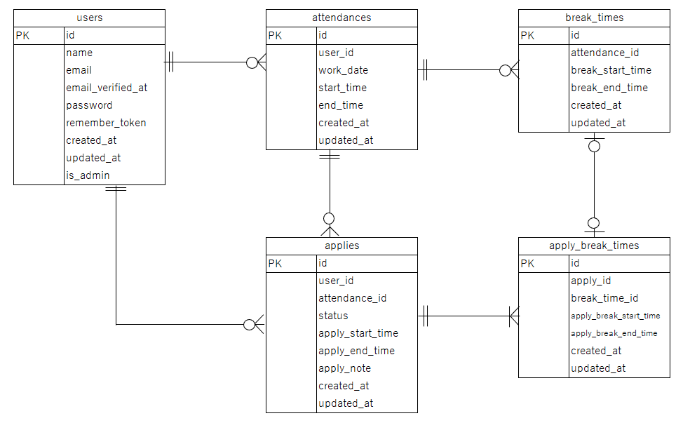

# アプリケーション名
coachtech 勤怠管理アプリ

## 概要
ユーザーの勤怠管理を行うアプリです。

# 環境構築

## Dockerビルド

### 1. Gitをクローン
```cmd
git clone git@github.com:Yumi-nichika/kintai.git
```

### 2. Dockerを起動
```cmd
docker-compose up -d --build
```

## Laravel環境構築

### 1. PHPコンテナに入る
```cmd
docker-compose exec php bash
```

### 2. コンポーザーをインストール
```cmd
composer install
```

### 3. .envファイルを作成
```cmd
cp .env.example .env
```

### 4. .envファイルを編集
DB接続情報を下記に変更
```env
DB_HOST=mysql
DB_DATABASE=laravel_db
DB_USERNAME=laravel_user
DB_PASSWORD=laravel_pass
```

送信元メールアドレスを追記
```env
MAIL_FROM_ADDRESS=test@example.com
```

### 5. マイグレーションを実行
```cmd
php artisan migrate
```

### 6. シーダーを実行
```cmd
php artisan db:seed
```

### 7. アプリケーションの暗号化キーを生成
```cmd
php artisan key:generate
```

### 8. アクセス
下記「URL」にアクセスし、正常に表示されれば完了です。

# 使用技術（実行環境）
- PHP 8.1.34
- Laravel 8.83.29
- mysql 8.0.26
- nginx 1.21.1
- mailhog 1.0.1

# ER図


# URL
会員登録：http://localhost/register

ログイン：http://localhost/login

```user
テストユーザー
メールアドレス：tarou@test.com
パスワード：password
```

管理者ログイン：http://localhost/admin/login

```admin
管理者ユーザー
メールアドレス：admin@test.com
パスワード：password
```

phpMyAdmin:http://localhost:8080

mailhog:http://localhost:8025

# PHPUnitでの単体テスト実行時

### 1. アプリケーションの暗号化キーを生成
```cmd
php artisan key:generate --env=testing
```

### 2. テスト用DBの作成
mysqlのrootパスワードは「docker-compose.yml」に記載
```cmd
docker-compose exec mysql bash
mysql -u root -p
CREATE DATABASE laravel_db_test;
exit;
exit
```

### 3. マイグレーションを実行
```cmd
docker-compose exec php bash
php artisan config:clear
php artisan migrate --env=testing
```

### 4. テスト実行
```cmd
php artisan config:clear
php artisan test
```